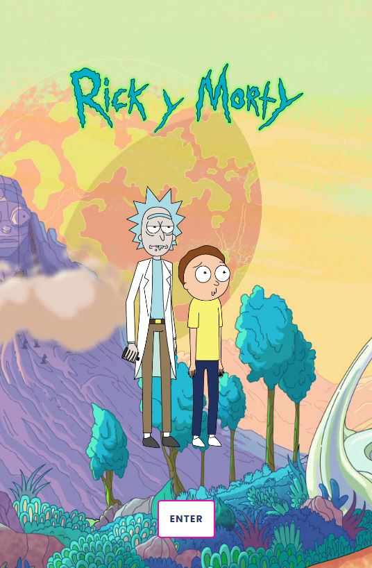
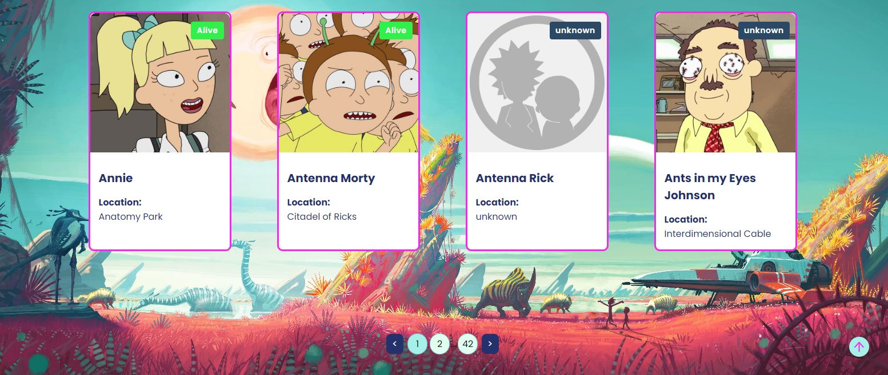
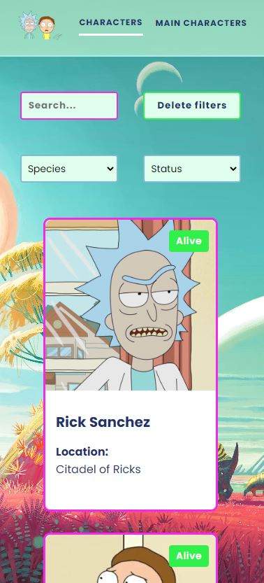
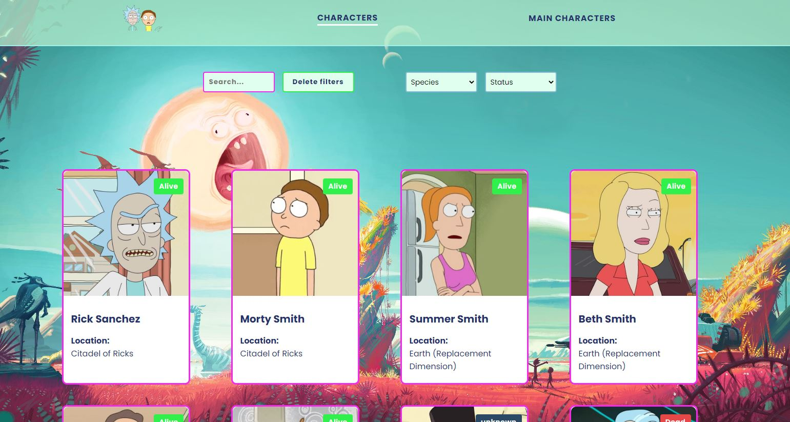
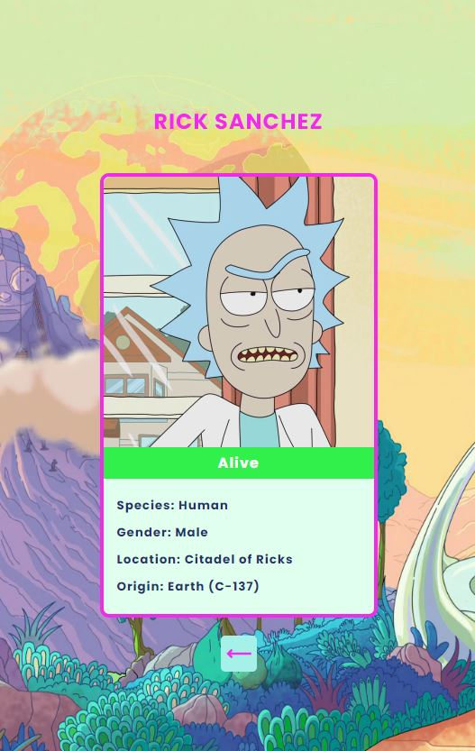
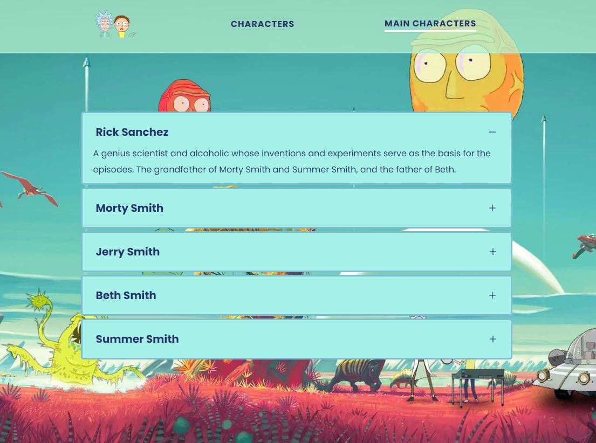

# RICK AND MORTY 

Bienvenid@s al proyecto de Rick and Morty! Espero que os guste!! :)

Para el proyecto he utilizado esta API ➡ https://rickandmortyapi.com/ 
Para la paginación he utilizado el paquete que proporciona NPM ➡ https://www.npmjs.com/package/react-paginate

Podeis ver el proyecto pinchando aquí ➡ https://veroisla.github.io/Rick-Morty/

## Sobre mí

- Portfolio - https://veroisla.github.io/Portfolio/
- Github -    https://github.com/veroisla
- Linkedin -  https://www.linkedin.com/in/veronica-isla-garcia-de-leaniz/

